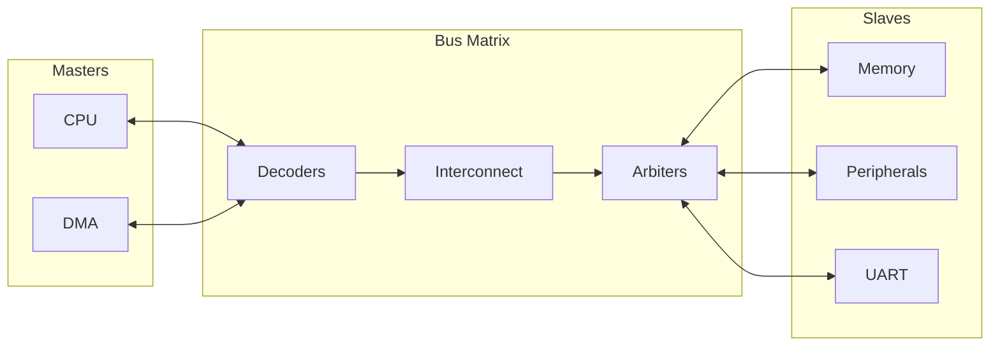
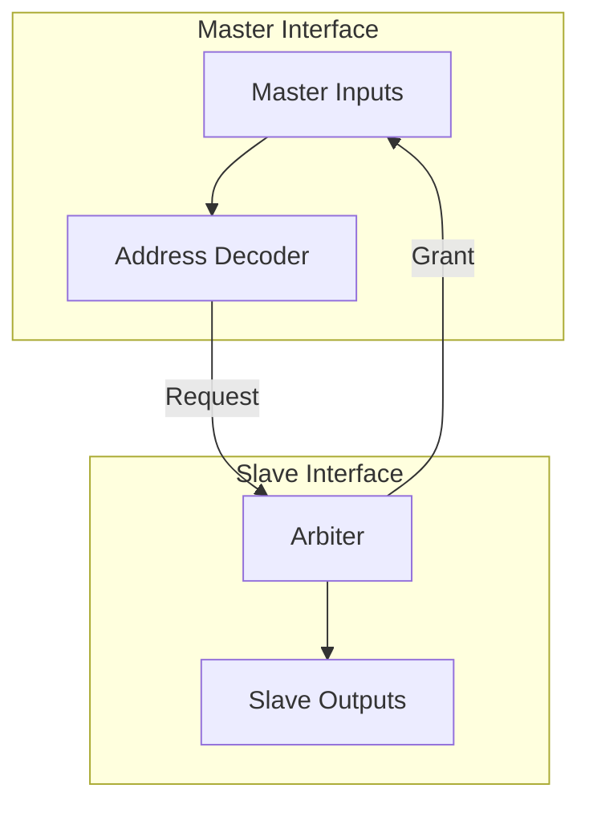

# Bus Matrix IP

## Overview
The Bus Matrix IP provides a high-performance, configurable interconnect for system-on-chip (SoC) designs. It supports multi-master, multi-slave communication with parallel access paths, enabling high-bandwidth data transfer. The IP includes distinct implementations for **AHB**, **AXI**, and **Wishbone** protocols, along with an **AHB-to-APB Bridge** for peripheral integration.

## Features
- **Configurable Connectivity**:
    - **N Masters** to **M Slaves** matrix.
    - Configurable address map for each slave.
    - Decoupled decoder/arbiter architecture for ease of scaling.
- **Protocols Supported**:
    - **AHB5-Lite**
    - **AXI4-Lite**
    - **Wishbone B4**
- **Arbitration Schemes**:
    - **Fixed Priority**: Configurable priority levels for each master.
    - **Round-Robin**: Fair bandwidth allocation among masters.
- **Error Handling**:
    - Default slave response for unmapped addresses (DECERR/SLVERR).
    - Protocol-compliant error propagation.
- **Peripherals**:
    - **AHB-to-APB Adapter**: Bridge for connecting low-speed APB4 peripherals to the high-speed AHB matrix.

## Verification Status
| Metric | Status | Notes |
|---|---|---|
| **Regression Tests** | ✅ **Passed** | 100% Pass across Xilinx, ModelSim, GHDL |
| **Code Coverage** | **Pending** | Planning for coverage collection |
| **Formal Proofs** | **In Progress** | Connectivity proofs defined |
| **Linting** | ✅ **Passed** | Clean for core matrix logic |

## Architecture

### System Overview


### Bus Matrix Internal


## Directory Structure
```
bus_matrix/
├── rtl/
│   ├── verilog/   # SystemVerilog implementation (Matrix + Bridge)
│   └── vhdl/      # VHDL implementation
├── sim/           # Simulation environments (ModelSim, Xilinx, GHDL, Icarus)
├── verif/         # Verification (UVM, Cocotb, Formal)
├── tools/         # Regression and Linting scripts
└── synthesis/     # Synthesis scripts (Vivado, Quartus, Yosys)
```

## Integration
The Bus Matrix is designed for "plug-and-play" integration.
1. Instantiate the specific protocol wrapper (e.g., `bus_matrix_ahb`).
2. Set `N_MASTERS` and `M_SLAVES` parameters.
3. specific the `ADDR_MAP` parameter array with start/end addresses for each slave.
4. Connect Master and Slave vectors.

### AHB-to-APB Bridge
Instantiate `ahb_apb_bridge` to connect an APB peripheral cluster to an AHB slave port on the matrix.
```systemverilog
ahb_apb_bridge #(
    .ADDR_WIDTH(32),
    .DATA_WIDTH(32)
) u_bridge (
    // AHB Slave Interface
    .ahb_...
    // APB Master Interface
    .apb_...
);
```
