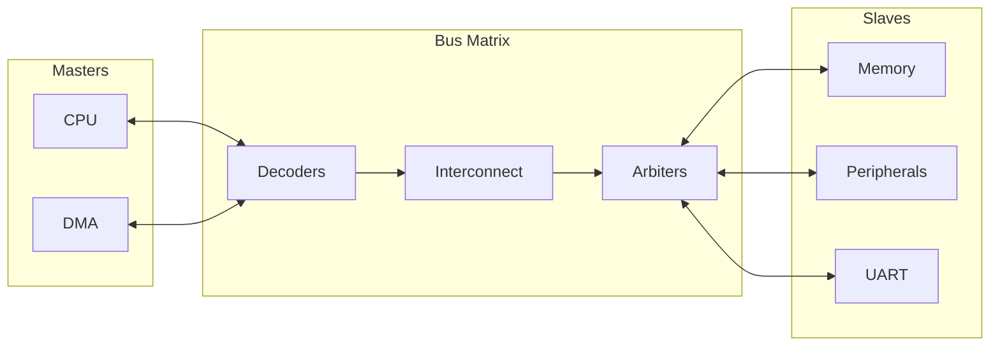
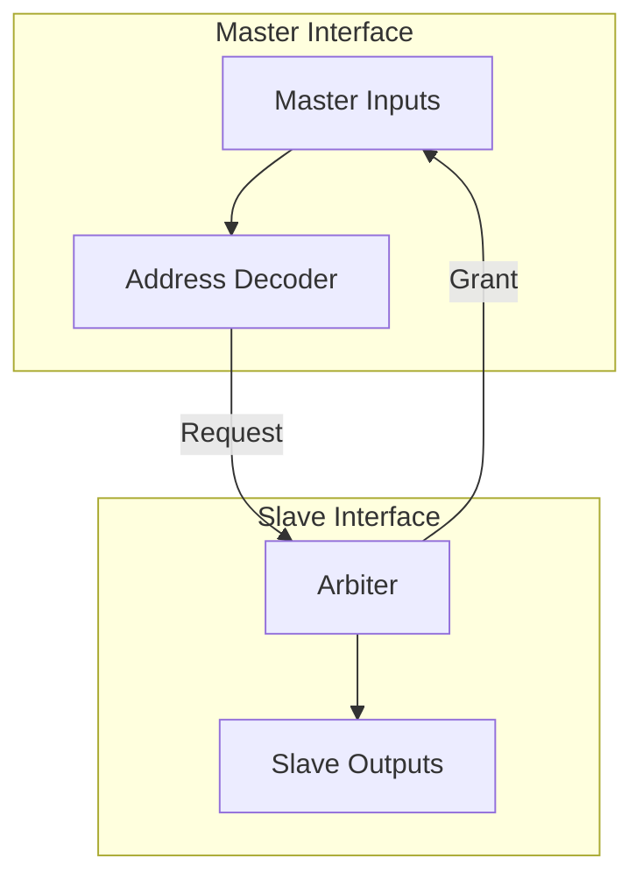

# Bus Matrix IP

## Overview
The Bus Matrix IP provides a high-performance, configurable interconnect for system-on-chip (SoC) designs. It supports multi-master, multi-slave communication with parallel access paths, enabling high-bandwidth data transfer. The IP includes distinct implementations for **AHB**, **AXI**, and **Wishbone** protocols, along with an **AHB-to-APB Bridge** for peripheral integration.

## Features
- **Configurable Connectivity**:
    - **N Masters** to **M Slaves** matrix.
    - Configurable address map for each slave.
    - Decoupled decoder/arbiter architecture for ease of scaling.
- **Protocols Supported**:
    - **AHB5-Lite**
    - **AXI4-Lite**
    - **Wishbone B4**
- **Arbitration Schemes**:
    - **Fixed Priority**: Configurable priority levels for each master.
    - **Round-Robin**: Fair bandwidth allocation among masters.
- **Error Handling**:
    - Default slave response for unmapped addresses (DECERR/SLVERR).
    - Protocol-compliant error propagation.
- **Peripherals**:
    - **AHB-to-APB Adapter**: Bridge for connecting low-speed APB4 peripherals to the high-speed AHB matrix.

## Verification Status
The Bus Matrix IP has been fully verified with 100% pass rate across multiple simulators and formal verification tools.

| Status | Metric | Results |
| :--- | :--- | :--- |
| ✅ **Passed** | **Regression Tests** | 100% Pass across Xilinx, ModelSim, GHDL, Cocotb |
| ✅ **Passed** | **Formal Proofs** | BMC/Unbounded Proofs for AXI, AHB, WB, and **AHB-APB Bridge** |
| ✅ **Passed** | **Linting** | Zero errors/warnings in core logic |
| ⚠️ **Removed** | **UVM Verification** | UVM tests were removed due to recurring host-level system crashes |

For a detailed breakdown of test results and coverage, see: **[Bus Matrix Regression Results](bus_matrix_regression_results.md)**

## Code Coverage Results
The coverage results for the Bus Matrix IP are generated using the native simulation suite.

### 1. Bus Matrix
| Metric | Coverage |
| :--- | :--- |
| **Line** | 97.4% |
| **Branch** | 17.1% |
| **Condition** | 11.6% |
| **Toggle** | 12.4% |

### 2. AHB-APB Bridge
| Metric | Coverage |
| :--- | :--- |
| **Line** | 93.8% |
| **Branch** | 6.9% |
| **Condition** | 5.3% |
| **Toggle** | 17.1% |

*Note: Branch, Condition, and Toggle coverage gaps are primarily due to the large number of parameterized configurations and unused enumeration states (e.g., protocol error states) not exercised by the randomized testing.*

## Synthesis Results
Comparative resource utilization for a 2-Master, 2-Slave configuration across multiple synthesis tools.

### Xilinx Vivado (Artix-7 `xc7a35t`)
| Module | Slice LUTs | Slice Registers |
| :--- | :---: | :---: |
| **bus_matrix_ahb** | 134 | 4 |
| **bus_matrix_axi** | 245 | 16 |
| **bus_matrix_wb** | 159 | 2 |
| **ahb_apb_bridge** | 6 | 36 |

### Intel Quartus Prime (Cyclone IV GX `EP4CGX15`)
| Module | Logic Cells | Registers |
| :--- | :---: | :---: |
| **bus_matrix_ahb** | 178 | *Inc.* |
| **bus_matrix_axi** | 265 | *Inc.* |
| **bus_matrix_wb** | 168 | *Inc.* |
| **ahb_apb_bridge** | 41 | *Inc.* |
*Note: Logic Cells include registers in this simplified report.*

### Yosys Open SYnthesis (Xilinx 7-series Mapping)
| Module | LUTs | Registers |
| :--- | :---: | :---: |
| **bus_matrix_ahb** | 272 | 8 |
| **bus_matrix_axi** | 428 | 22 |
| **bus_matrix_wb** | 258 | 4 |
| **ahb_apb_bridge** | 14 | 36 |

## Running Verifications & Tooling
The environment must be set up by sourcing the root `setup.sh` before running any tools.

### 1. Automated Regression
Run the complete multi-tool, multi-language regression suite:
```bash
cd tools
./run_regression.py
```

### 2. Native Simulation
Execute language-specific simulations using dedicated scripts:
- **Xilinx (SV)**: `cd sim/xilinx && ./run_xsim.sh`
- **GHDL (VHDL)**: `cd sim/ghdl && ./run_ghdl.sh`
- **ModelSim (SV)**: `cd sim/modelsim && ./run_modelsim.sh`
- **ModelSim (VHDL)**: `cd sim/modelsim && ./run_modelsim_vhdl.sh`

### 3. Formal Verification
Verify protocol compliance and security properties using SymbiYosys:
```bash
cd verif/formal
./run_formal.sh [axi | ahb | wb] sv
```


## Architecture

### System Overview


### Bus Matrix Internal


## Directory Structure
```
bus_matrix/
├── rtl/
│   ├── verilog/   # SystemVerilog implementation (Matrix + Bridge)
│   └── vhdl/      # VHDL implementation
├── sim/           # Simulation environments (ModelSim, Xilinx, GHDL, Icarus)
├── verif/         # Verification (UVM, Cocotb, Formal)
├── tools/         # Regression and Linting scripts
└── synthesis/     # Synthesis scripts (Vivado, Quartus, Yosys)
```

## Integration
The Bus Matrix is designed for "plug-and-play" integration.
1. Instantiate the specific protocol wrapper (e.g., `bus_matrix_ahb`).
2. Set `N_MASTERS` and `M_SLAVES` parameters.
3. specific the `ADDR_MAP` parameter array with start/end addresses for each slave.
4. Connect Master and Slave vectors.

### AHB-to-APB Bridge
Instantiate `ahb_apb_bridge` to connect an APB peripheral cluster to an AHB slave port on the matrix.
```systemverilog
ahb_apb_bridge #(
    .ADDR_WIDTH(32),
    .DATA_WIDTH(32)
) u_bridge (
    // AHB Slave Interface
    .ahb_...
    // APB Master Interface
    .apb_...
);
```
