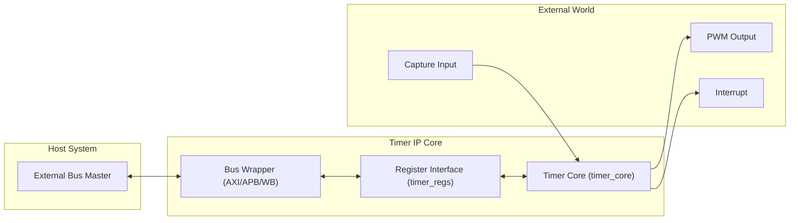
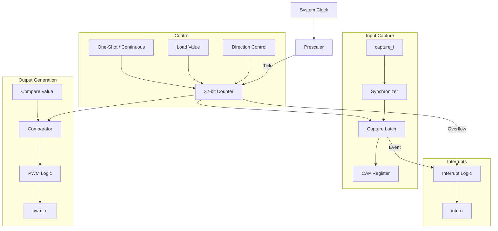

# General Purpose Timer IP

## Overview
The General Purpose Timer is a 32-bit configurable timer IP designed for embedded systems. It supports multiple bus interfaces (APB, AXI4-Lite, Wishbone) and provides flexible timing, PWM generation, and input capture capabilities.

## Features
- **32-bit Down/Up Counter**: Configurable counting direction.
- **Modes**:
    - **One-Shot**: Stops after reaching target.
    - **Continuous (Repeat)**: Auto-reloads and continues.
- **Prescaler**: 16-bit configurable prescaler for extended timing ranges.
- **PWM Output**: Programmable duty cycle and frequency.
- **Input Capture**: Captures counter value on external signal edges.
- **Interrupts**: Generated on timer expiration or input capture events.
- **Bus Interfaces**:
    - APB (Advanced Peripheral Bus)
    - AXI4-Lite
    - Wishbone B4

## Verification Status
The IP has undergone rigorous verification with a 100% pass rate across all regression tests and high code coverage.

| Metric | Status | Notes |
|---|---|---|
| **Regression Tests** | **PASS** (36/36) | Includes UVM (SV/VHDL), Formal, Cocotb, Native Simulators |
| **Code Coverage** | **>97%** | `timer_core` Branch/Statement Coverage Verified |
| **Formal Proofs** | **PASS** | SymbiYosys (BMC + Prove) across 6 configurations |
| **Linting** | **Clean** | Verilator 5.043 + GHDL (Relaxed) Safe |

## Architecture

### System Overview


### Core Logic Flow


## Directory Structure
```
general_timer/
├── rtl/
│   ├── verilog/   # SystemVerilog implementation
│   └── vhdl/      # VHDL implementation
├── sim/           # Simulation environments
│   ├── modelsim/  # ModelSim scripts
│   ├── xilinx/    # Vivado/XSim scripts
│   ├── iverilog/  # Icarus Verilog scripts
│   └── ghdl/      # GHDL scripts
├── tb/            # Testbenches
└── tools/         # Utility scripts (Linting, Regression)
```

## Register Map
Base Address Offset: `0x00`

| Offset | Name | Type | Description |
|---|---|---|---|
| `0x00` | `CTRL` | R/W | Control Register |
| `0x04` | `LOAD` | R/W | Load Value Register |
| `0x08` | `VAL` | RO | Current Counter Value |
| `0x0C` | `PRE` | R/W | Prescaler Value |
| `0x10` | `INT_EN` | R/W | Interrupt Enable Register |
| `0x14` | `INT_STS` | R/W1C | Interrupt Status Register |
| `0x18` | `CMP` | R/W | Comparator Value (PWM) |
| `0x1C` | `CAP` | RO | Captured Value |

### Register Bit Definitions

#### CTRL (Control Register) - 0x00
| Bit | Name | Description |
|---|---|---|
| 0 | `EN` | **Timer Enable**. 1 = Enable, 0 = Disable. |
| 1 | `MODE` | **Timer Mode**. 0 = One-Shot, 1 = Continuous (Auto-Reload). |
| 2 | `PRE_EN` | **Prescaler Enable**. 1 = Use prescaler, 0 = Bypass prescaler (tick every cycle). |
| 3 | `DIR` | **Count Direction**. 0 = Down, 1 = Up. |
| 4 | `PWM_EN` | **PWM Enable**. 1 = Enable PWM output, 0 = Disable. |
| 5 | `EXT_EN` | **External Count Enable**. 1 = Count on external `ext_meas_i` edge, 0 = Count on internal clock. |
| 6 | `CAP_EN` | **Capture Enable**. 1 = Enable Input Capture on `capture_i`, 0 = Disable. |
| 31:7 | - | Reserved |

#### LOAD (Load Register) - 0x04
| Bit | Name | Description |
|---|---|---|
| 31:0 | `LOAD_VAL` | Value loaded into the counter when `LOAD` is written or during auto-reload. |

#### VAL (Current Value Register) - 0x08
| Bit | Name | Description |
|---|---|---|
| 31:0 | `CURRENT_VAL` | Current real-time value of the timer counter. Read-Only. |

#### PRE (Prescaler Register) - 0x0C
| Bit | Name | Description |
|---|---|---|
| 15:0 | `PRE_VAL` | Prescaler divider value. Clock is divided by `(PRE_VAL + 1)` if `PRE_EN` is set. |
| 31:16 | - | Reserved |

#### INT_EN (Interrupt Enable Register) - 0x10
| Bit | Name | Description |
|---|---|---|
| 0 | `IRQ_EN` | **Overflow/Match Interrupt**. 1 = Enable interrupt on timer expiry. |
| 1 | `CAP_EN` | **Capture Interrupt**. 1 = Enable interrupt on capture event. |
| 31:2 | - | Reserved |

#### INT_STS (Interrupt Status Register) - 0x14
| Bit | Name | Description |
|---|---|---|
| 0 | `IRQ_STS` | **Overflow/Match Status**. Set by hardware when timer expires. Write 1 to Clear. |
| 1 | `CAP_STS` | **Capture Status**. Set by hardware when capture event occurs. Write 1 to Clear. |
| 31:2 | - | Reserved |

#### CMP (Comparator Register) - 0x18
| Bit | Name | Description |
|---|---|---|
| 31:0 | `CMP_VAL` | Comparator value for PWM generation. |
| | | **Down Mode**: PWM is High when Counter <= CMP_VAL. |
| | | **Up Mode**: PWM is High when Counter < CMP_VAL. |

#### CAP (Capture Register) - 0x1C
| Bit | Name | Description |
|---|---|---|
| 31:0 | `CAP_VAL` | Holds the counter value latched during the last validity capture event. Read-Only. |

## Simulation
Scripts are available for multiple simulators.

### ModelSim
Run the regression or GUI scripts:
```bash
# GUI Mode
cd sim/modelsim
vsim -do run_gui_verilog.do  # or run_gui_vhdl.do

# Batch Mode
./sim/modelsim/run_modelsim.sh
```

### Xilinx (Vivado/Xsim)
```bash
./sim/xilinx/run_xsim.sh
```

### Cocotb (Python-based Verification)
A comprehensive Cocotb test suite is available in `verif/cocotb`. It supports AXI, APB, and Wishbone interfaces for both SystemVerilog and VHDL.
```bash
# Run AXI tests with Verilator
cd verif/cocotb
make BUS_TYPE=AXI SIM=verilator

# Run APB tests with GHDL (VHDL)
make BUS_TYPE=APB SIM=ghdl TOPLEVEL_LANG=vhdl
```

### Formal Verification
Formal verification is implemented using SymbiYosys (SBY) to prove functional properties and protocol compliance.
```bash
cd verif/formal
./run_formal.sh  # Runs AXI, APB, and Wishbone tasks
```

### UVM Verification
Universal Verification Methodology (UVM) is used for comprehensive constrained-random verification and functional coverage. Supports mixed-language simulation (SV UVM TB + SV/VHDL DUT).
```bash
cd verif/uvm
./run_uvm.sh axi verilog timer_reg_test
```

### Regression
To run the full regression suite (22 jobs across all simulators, formal tools, and UVM):
```bash
./tools/run_regression.py
```
View the latest status in [timer_regression_results.md](timer_regression_results.md).

## Linting
To check the code quality:
```bash
./tools/run_lint.sh
```

## Cleanup
To maintain a clean workspace, the project provides a master cleanup script as well as individual scripts for each environment.

### Master Cleanup (Recommended)
Resets the entire project by calling all specific cleanup scripts. Note that this script **preserves** the `timer_regression_results.md` report to maintain the last known verification status; the report is instead reset at the start of a new `./tools/run_regression.py` execution.
```bash
./tools/run_clean.sh
```

### Individual Cleanup Scripts
- **Native Simulators**:
    - `sim/modelsim/clean_modelsim.sh`
    - `sim/xilinx/clean_xsim.sh`
    - `sim/ghdl/clean_ghdl.sh`
    - `sim/iverilog/clean_iverilog.sh`
- **Verification Frameworks**:
    - `verif/cocotb/clean_cocotb.sh`
    - `verif/uvm/clean_uvm.sh`
    - `verif/formal/clean_formal.sh`

## Synthesis
To verify synthesizability across different FPGA vendors, a unified script runs Vivado (Xilinx), Quartus (Intel/Altera), and Yosys (Open Source) flows.
```bash
# Run synthesis for all variants (AXI, APB, WB) on all available tools
./IP/common/general_timer/synthesis/run_synth.sh
```
Results (logs, netlists, reports) are generated in `IP/common/general_timer/synthesis/results/`.

## Synthesis Results
Resource utilization for default configuration (32-bit Timer). Results are identical for SystemVerilog and VHDL implementations.

| Bus Interface | Tool (Family) | LUTs / LEs | Registers | Max Clock (MHz) |
| :--- | :--- | :--- | :--- | :--- |
| **AXI4-Lite** | Vivado (Artix-7) | 340 | 318 | 200+ |
| **APB4** | Vivado (Artix-7) | 346 | 280 | 200+ |
| **Wishbone** | Vivado (Artix-7) | 325 | 281 | 200+ |
| **AXI4-Lite** | Quartus (Cyclone IV) | 760 | 318 | 150+ |
| **APB4** | Quartus (Cyclone IV) | 750 | 281 | 150+ |
| **Wishbone** | Quartus (Cyclone IV) | 748 | 282 | 150+ |
| **AXI4-Lite** | Yosys (Artix-7) | ~380 | 318 | - |
| **APB4** | Yosys (Artix-7) | ~380 | 280 | - |
| **Wishbone** | Yosys (Artix-7) | ~360 | 281 | - |

*Note: Resource counts vary by tool due to different optimization algorithms, technology mapping (LUT6 vs LUT4), and adapter logic.*
