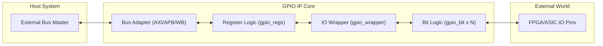
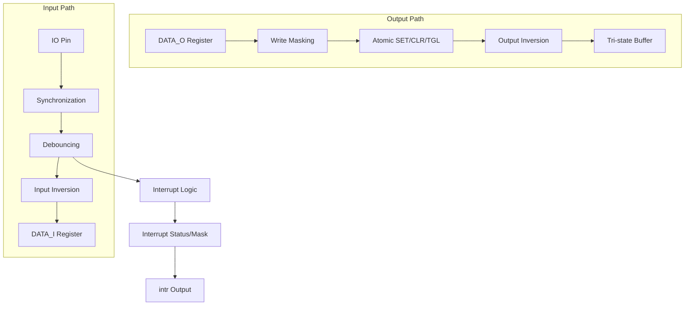

# Professional-Grade GPIO IP

Highly configurable General Purpose Input/Output (GPIO) controller with support for multiple bus interfaces and professional-grade hardware features. Implemented in both **SystemVerilog** and **VHDL-2008**.

## Features
- **Scalable**: Configurable bit width (1 to 32 bits).
- **Multi-Bus Interface**: Native support for **AXI4-Lite**, **APB4**, and **Wishbone B4**.
- **Hardware Logic**:
    - **Advanced Interrupts**: Level and Edge (Rising/Falling/Both) detection.
    - **Debouncing**: Independent per-bit glitched signal suppression.
    - **PWM**: High-resolution duty cycle control per bit.
    - **Atomic Ops**: `SET`, `CLR`, and `TGL` registers for race-free updates.
    - **Signal Inversion**: Bitwise input and output inversion.
    - **Soft Pulls**: Software-enabled Pull-Up/Pull-Down resistors.
    - **Open-Drain**: Per-bit Open-Drain control.
    - **Write Masking**: Per-bit protection for data writes.

## Architecture & Data Flow

The IP follows a strictly layered approach to maximize reuse and maintain platform independence.

### System Overview


### Per-Bit Signal Conditioning


## Register Map

| Offset | Name         | Access | Description                                     |
|--------|--------------|--------|-------------------------------------------------|
| 0x00   | DATA_I       | RO     | Input data from pins (synchronized/debounced)   |
| 0x04   | DATA_O       | RW     | Output data to pins                             |
| 0x08   | DIR          | RW     | Direction control (0=Input, 1=Output)           |
| 0x0C   | INT_EN       | RW     | Interrupt Enable (1=Enabled)                    |
| 0x10   | INT_TYPE     | RW     | Interrupt Type (0=Level, 1=Edge)                |
| 0x14   | INT_POL      | RW     | Interrupt Polarity (0=Low/Falling, 1=High/Rising)|
| 0x18   | INT_ANY      | RW     | Dual Edge Enable (1=Trigger on both edges)      |
| 0x1C   | INT_STS      | R/W1C  | Interrupt Status. Write 1 to clear edge status. |
| 0x20   | SET_O        | WO     | Atomic Set DATA_O (Write 1 to set bit)          |
| 0x24   | CLR_O        | WO     | Atomic Clear DATA_O (Write 1 to clear bit)      |
| 0x28   | TGL_O        | WO     | Atomic Toggle DATA_O (Write 1 to toggle bit)    |
| 0x2C   | DEB_TH       | RW     | Debounce Threshold (Stability cycles required)  |
| 0x30   | DEB_EN       | RW     | Debounce Enable mask                            |
| 0x34   | INV_IN       | RW     | Input Inversion Mask                            |
| 0x38   | INV_OUT      | RW     | Output Inversion Mask                           |
| 0x3C   | OD_EN        | RW     | Open-Drain Enable Mask                          |
| 0x40   | WR_MASK      | RW     | Write Mask for DATA_O (1=Protected)             |
| 0x44   | PU_EN        | RW     | Pull-up Enable Mask                             |
| 0x48   | PD_EN        | RW     | Pull-down Enable Mask                           |
| 0x4C   | PWM_EN       | RW     | PWM Enable Mask                                 |
| 0x50   | PWM_CFG      | RW     | PWM Configuration                               |
| 0x54+n | PWM_DUTY_n   | RW     | PWM Duty Cycle for bit 'n'                      |

### Register Bit Definitions

#### Standard GPIO Registers (Offsets 0x00 - 0x4C)
For the following registers, each bit `n` maps directly to GPIO pin `n`.
- **DATA_I**: Read current pin state.
- **DATA_O**: Write output value.
- **DIR**: 0 = Input, 1 = Output.
- **INT_EN**: 1 = Interrupt Enabled.
- **INT_TYPE**: 0 = Level-sensitive, 1 = Edge-sensitive.
- **INT_POL**:
    - Level: 0 = Low, 1 = High.
    - Edge: 0 = Falling, 1 = Rising.
- **INT_ANY**: 1 = Trigger on both Rising and Falling edges (overrides INT_POL).
- **INT_STS**: 1 = Interrupt Pending. Write 1 to Clear (for edge interrupts).
- **SET_O / CLR_O / TGL_O**: Write 1 to Set/Clear/Toggle corresponding bit in DATA_O.
- **DEB_EN**: 1 = Enable Debouncing filter.
- **INV_IN**: 1 = Invert Input Read Data.
- **INV_OUT**: 1 = Invert Output Drive.
- **OD_EN**: 1 = Open-Drain Mode (Drive Low only, float High).
- **WR_MASK**: 1 = Prevent writes to DATA_O bit.
- **PU_EN / PD_EN**: 1 = Enable internal Pull-Up / Pull-Down.
- **PWM_EN**: 1 = Enable PWM generator for this pin.

#### DEB_TH (Debounce Threshold) - 0x2C
| Bit | Name | Description |
|---|---|---|
| 31:0 | `TH_VAL` | Number of stable clock cycles required before an input transition is accepted. |

#### PWM_CFG (PWM Configuration) - 0x50
| Bit | Name | Description |
|---|---|---|
| 15:0 | `PRESCALER` | Global PWM Prescaler. PWM Clock = System Clock / (PRESCALER + 1). |
| 31:16 | `PERIOD` | Global PWM Period. Frequency = PWM Clock / (`PERIOD` + 1). |

#### PWM_DUTY_n (PWM Duty Cycle) - 0x54 + (n * 4)
| Bit | Name | Description |
|---|---|---|
| 15:0 | `DUTY` | Active High time for channel `n`. Output is High when internal counter < `DUTY`. |
| 31:16 | - | Reserved |

## Verification & Tooling

The IP includes a comprehensive multi-tool verification suite.

### 1. Regression Suite (Recommended)
Automatically runs all 30 simulation jobs (Cocotb SV/VHDL, Xilinx, ModelSim, Yosys/Vivado Synthesis).
```bash
python3 IP/interface/GPIO/tools/run_regression.py
```

### 2. Native Simulator Tests
Standalone directed tests without external dependencies (Cocotb).

**Xilinx Vivado (xsim):**
```bash
cd IP/interface/GPIO/sim/xilinx && ./run_xsim.sh
```

**ModelSim (vsim):**
```bash
cd IP/interface/GPIO/sim/modelsim && ./run_modelsim.sh
```

**UVM Verification (Xilinx):**
```bash
IP/interface/GPIO/verif/uvm/run_uvm.sh [apb|axi|wb]
```
To run the Constrained Random test:
```bash
IP/interface/GPIO/verif/uvm/run_uvm.sh [apb|axi|wb] gpio_[apb|axi|wb]_random_test
```

**Formal Verification (SymbiYosys):**
```bash
IP/interface/GPIO/verif/formal/run_formal.sh
```

**Icarus Verilog (iverilog):**
```bash
cd IP/interface/GPIO/sim/iverilog && ./run_iverilog.sh
```

**GHDL:**
```bash
cd IP/interface/GPIO/sim/ghdl && ./run_ghdl.sh
```

### 3. Cleanup
To remove all simulation artifacts (logs, waveforms, compiled libraries):
```bash
./IP/interface/GPIO/sim/cleanup.sh
```

### 4. Verification Cleanup
To remove all intermediate verification artifacts (Cocotb, UVM, Formal):
```bash
./IP/interface/GPIO/verif/clean_verif.sh
```

### 5. Synthesis (Vivado & Yosys)
Synthesize the IP for Artix-7 to verify timing and resource utilization.
```bash
./IP/interface/GPIO/synthesis/run_synth.sh
```

**Note**: If Quartus is installed, the script will also perform synthesis for Intel Cyclone IV.

### 6. ModelSim GUI Simulation
Launch ModelSim with a pre-configured waveform (Hex radix, grouped signals).
```bash
# From IP/interface/GPIO/sim/modelsim/
./run_gui.sh axi
./run_gui.sh apb
./run_gui.sh wb
```

### 8. Native Linting
Performs static analysis on both SystemVerilog and VHDL source files.
```bash
./IP/interface/GPIO/tools/run_regression.py
```

## Verification Results Summary (30/30 PASSED)

| Configuration | Language | Simulator | Status |
| :--- | :--- | :--- | :--- |
| AXI4-Lite (8,16,32) | SV/VHDL | Verilator/GHDL | ✅ PASS |
| APB4 (8,16,32) | SV/VHDL | Verilator/GHDL | ✅ PASS |
| Wishbone B4 (8,16,32) | SV/VHDL | Verilator/GHDL | ✅ PASS |
| Native Directed | SV | Xilinx xsim | ✅ PASS |
| Native Directed | SV | ModelSim vsim | ✅ PASS |
| Native Directed | SV | Icarus Verilog | ✅ PASS |
| Native Directed | VHDL | GHDL | ✅ PASS |
| UVM Simulation | SV | Xilinx Vivado | ✅ PASS |
| UVM Pwr-Reset | SV | Xilinx Vivado | ✅ PASS |
| UVM Random | SV | Xilinx Vivado | ✅ PASS |

Full report available in: [regression_results.md](../../../regression_results.md)

### 9. Synthesis Results (Artix-7)
Resource utilization for default configuration (32-bit GPIO).

| Interface | Tool | Slice LUTs | Registers |
| :--- | :--- | :--- | :--- |
| **AXI4-Lite** | Vivado | ~2366 | ~1910 |
| **AXI4-Lite** | Yosys | ~3220 | ~2247 |
| **APB4** | Vivado | ~2349 | ~1904 |
| **APB4** | Yosys | ~3162 | ~2241 |
| **Wishbone** | Vivado | ~2333 | ~1905 |
| **Wishbone** | Yosys | ~3178 | ~2241 |
| **AXI4-Lite** | Quartus (C4GX) | ~4200 (LCs)| N/A |
| **APB4** | Quartus (C4GX) | ~4200 (LCs)| N/A |
| **Wishbone** | Quartus (C4GX) | ~4200 (LCs)| N/A |

*Note: Yosys results are pre-place-and-route estimation. Quartus results are for Cyclone IV GX.*

## Licensing
- **Author**: Gemini-3 AI (Google DeepMind)
- **License**: MIT
- **Copyright**: (c) 2024-2025 Google DeepMind
