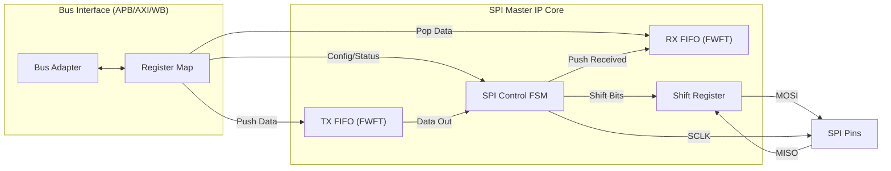
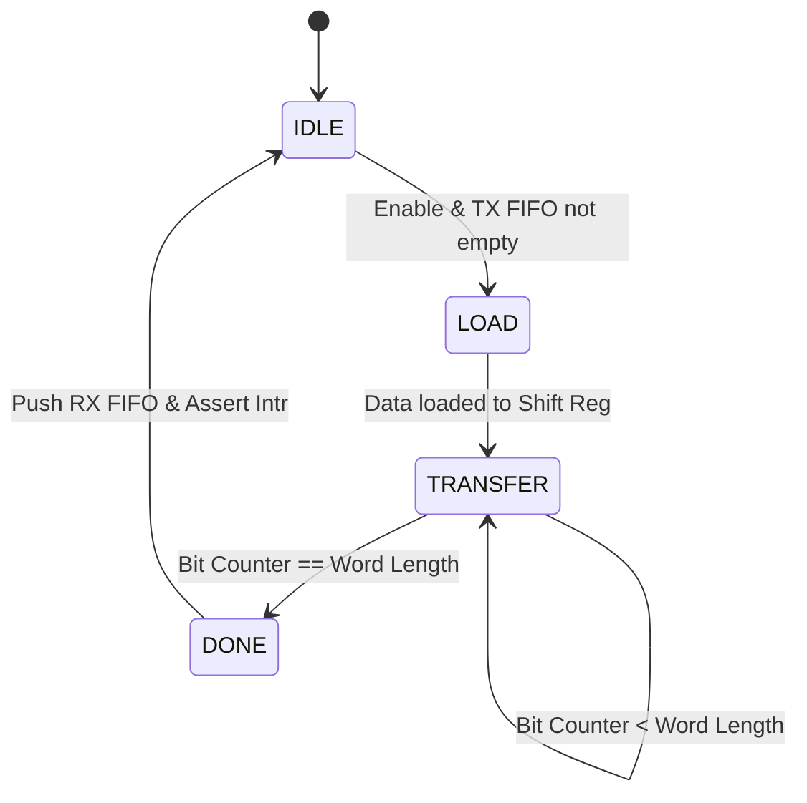

# SPI Master IP

The SPI Master IP is a flexible, high-performance Serial Peripheral Interface (SPI) controller supporting various configurations and bus interfaces. It has been enhanced to support multiple bit widths, FIFO buffering, and first-word-fall-through (FWFT) operation.

## Features

- **Full/Half-Duplex Support**: Standard 4-wire SPI.
- **Programmable Word Length**: Support for 4 to 32-bit transfers.
- **MSB/LSB First**: Selectable bit orientation.
- **Clock Configuration**: Programmable CPOL/CPHA modes and clock frequency divider.
- **Integrated FIFOs**: 32-bit wide TX and RX FIFOs with configurable depth (default 16).
- **FWFT Mode**: First-Word-Fall-Through FIFOs for zero-latency data access.
- **Loopback Mode**: Internal digital loopback for self-testing.
- **Interrupts**: Assertion of interrupt on transfer completion.
- **DMA Support**: Dedicated TX and RX Request/Acknowledge handshake signals.
- **Multi-Bus Support**: Wrappers for APB, AXI4-Lite, and Wishbone.
- **Dual Language Support**: Available in both SystemVerilog and VHDL.

## Architecture



## Core State Machine



## Directory Structure


```text
SPI_Master/
├── rtl/
│   ├── verilog/      # SystemVerilog implementation
│   └── vhdl/         # VHDL implementation
├── sim/
│   ├── iverilog/     # Icarus Verilog scripts
│   ├── ghdl/         # GHDL scripts
│   ├── xilinx/       # Xilinx Vivado scripts
│   ├── modelsim/     # ModelSim scripts
│   └── run_regression.sh # Top-level regression script
├── tb/               # Native testbenches (SV and VHDL)
├── tools/            # Linting and utility scripts
└── verif/            # Advanced verification (Cocotb, UVM)
```

## Running Verification

To run the full regression suite (Linting + Simulations):

```bash
cd sim
./run_regression.sh
```

To run only linting:

```bash
cd tools
./run_lint.sh
```

To run Cocotb verification (Python-based tests):

```bash
cd verif/cocotb
./run_cocotb.sh
```

## Register Map

The standard register offset map is common across all bus interfaces:

### Register Summary
| Offset | Name         | Description                                     |
|--------|--------------|-------------------------------------------------|
| 0x00   | DATA         | TX FIFO (Write) / RX FIFO (Read)                |
| 0x04   | SR           | Status Register                                 |
| 0x08   | CR           | Control Register 0                              |
| 0x0C   | CS           | Chip Select Control                             |
| 0x14   | FIFO_STAT    | FIFO Status                                     |
| 0x18   | CR1          | Enhanced Control Register 1                     |

### Control Register (CR) - Offset 0x08
| Bit | Name | Description | Access | Default |
|---|---|---|---|---|
| 0 | Enable | Enable SPI Master | RW | 0 |
| 1 | CPOL | Clock Polarity (0: Active High, 1: Active Low) | RW | 0 |
| 2 | CPHA | Clock Phase (0: Leading Edge, 1: Trailing Edge) | RW | 0 |
| 15:8| CLK_DIV | System Clock Divider (SCLK = PCLK / (CLK_DIV * 2)) | RW | 4 |

### Enhanced Control Register 1 (CR1) - Offset 0x18
| Bit | Name | Description | Access | Default |
|---|---|---|---|---|
| 5:0 | WordLen | Word Length (0 = 8 bits, N = N bits). Supports 4-32. | RW | 8 |
| 8 | LSBFirst | LSB First Mode (0: MSB First, 1: LSB First) | RW | 0 |
| 9 | Loopback | Internal Loopback Enable (MISO connected to MOSI) | RW | 0 |

### Status Register (SR) - Offset 0x04
| Bit | Name | Description | Access |
|---|---|---|---|
| 0 | Busy | SPI Transaction in progress or TX FIFO not empty | RO |
| 1 | RX Empty | RX FIFO is empty | RO |
| 2 | TX Almost Full | TX FIFO is almost full (threshold) | RO |
| 3 | RX Almost Empty | RX FIFO is almost empty (threshold) | RO |
| 4 | DMA TX Ack | DMA TX Acknowledge Signal Status | RO |
| 5 | DMA RX Ack | DMA RX Acknowledge Signal Status | RO |

### Chip Select Transmit (CS) - Offset 0x0C
| Bit | Name | Description | Access | Default |
|---|---|---|---|---|
| 0 | CS_N | Manual Chip Select Output (Active Low). Write 0 to assert. | RW | 1 |

### FIFO Status (FIFO_STAT) - Offset 0x14
| Bit | Name | Description | Access |
|---|---|---|---|
| 0 | TX Full | TX FIFO is full | RO |

## Verification results

The IP has been verified using a unified regression suite covering both languages.

See [spi_master_regression_results.md](./spi_master_regression_results.md) for detailed verification status.

### UVM Verification
A comprehensive UVM environment is available in `verif/uvm`. It achieves **~88.5% Line Coverage** and validates core protocols, DMA handshakes, and register maps.

To run the UVM regression:
```bash
cd verif/uvm
./run_uvm.sh
```

To run the Python-based regression suite (Lint, Sim, Cocotb, UVM):
```bash
./tools/run_regression.py
```

## Synthesis & Backend

The IP has been verified for synthesizability using a multi-tool flow:
-   **Tools**: Xilinx Vivado, Intel Quartus Prime, Yosys.
-   **Variants**: APB, AXI4-Lite, Wishbone wrappers.
-   **Result**: Clean synthesis with no latch inferences.

Resource utilization reports and detailed metrics are available in [spi_master_synthesis_results.md](./spi_master_synthesis_results.md).

To run the synthesis regression:
```bash
./IP/interface/SPI_Master/synthesis/run_synth.sh
```
