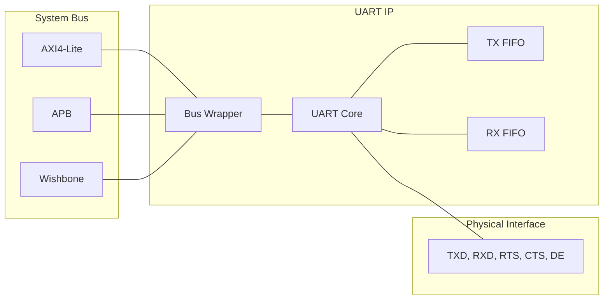
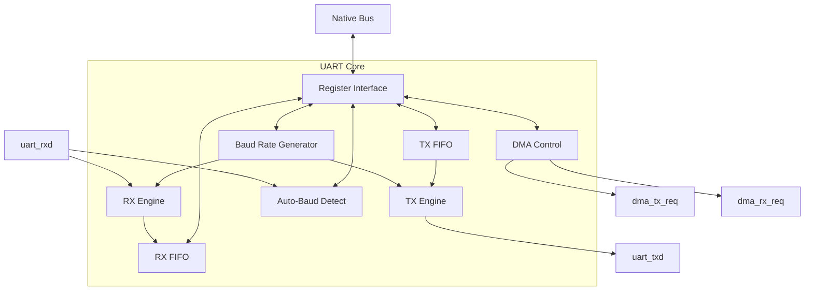

# UART IP Core

Generic UART Core with Native Register Interface and multiple bus wrappers (AXI4-Lite, APB, Wishbone).

## Architecture

### High-Level Block Diagram

### Core Internal Structure

## Features
- **Configurable Baud Rate**: 16-bit divisor + 4-bit fractional for high precision.
- **Hardware FIFOs**: Independent TX and RX FIFOs (depth 16).
- **Flow Control**: Hardware RTS/CTS with optional auto-management.
- **RS-485 Support**: 9-bit mode and Driver Enable (DE) signal control.
- **DMA Interface**: Dedicated handshake signals for TX and RX.
- **Infrared (IrDA)**: SIR modulation/demodulation support.
- **Auto-Baud Detection**: Automatic baud rate measurement.
- **Internal Loopback**: Self-test mode for hardware validation.
- **Multiple Bus Wrappers**: AXI4-Lite, APB, and Wishbone.
- **Dual RTL**: SystemVerilog and VHDL-2008 implementations.

## Directory Structure
- `rtl/verilog/`: SystemVerilog RTL.
- `rtl/vhdl/`: VHDL-2008 RTL.
- `IP/common/`: Shared components (FIFOs, adapters).
- `tb/`: Native testbenches.
- `verif/cocotb/`: Cocotb test environment.
- `tools/`: Linting and regression scripts.

## Register Map
| Offset | Name | Description |
|--------|------|-------------|
| 0x00 | DR   | Data Register (W: TX, R: RX) |
| 0x04 | SR   | Status Register (TX Full/Empty, RX Full/Empty, Ready, Errors) |
| 0x08 | CR   | Control Register (TX/RX En, Stop Bits, Parity, Loopback, Flow Control) |
| 0x0C | BAUD | Baud Rate Divisor (Lower 16-bits) |
| 0x10 | ISR  | Interrupt Status Register (Read/W1C) |
| 0x14 | IMR  | Interrupt Mask Register |
| 0x18 | FCR  | FIFO Control Register (Flush TX/RX) |
| 0x1C | DCR  | DMA Control Register (TX/RX DMA En) |
| 0x20 | ABCR | Auto-Baud Control Register (En, Mode) |

## Verification Status
For detailed verification results, see [Regression Results](uart_regression_results.md).

- **Lint**: PASSED (Verilator, GHDL)
- **Native Sim**: PASSED (Icarus, GHDL)
- **Functional**: PASSED (Cocotb regression suite)
- **UVM**: PASSED (Comprehensive 9-test suite, **90.5% Core RTL Coverage**)
- **Formal**: PASSED (SymbiYosys, Core + Bus Interfaces)
- **Synthesis**: PASSED (Vivado, Quartus, Yosys)

## Synthesis Characterization

The UART IP has been characterized for area and performance across multiple FPGA architectures. Results are shown for the three bus interface wrappers.

### Resource Utilization (Xilinx Artix-7)
Target Part: `xc7a35tcpg236-1`

| Interface | LUTs | Flip-Flops |
|-----------|------|------------|
| **APB**   | 611  | 618        |
| **AXI4-Lite**| 628 | 656        |
| **Wishbone**| 614 | 619        |

### Resource Utilization (Intel Cyclone V)
Target Device: `5CGXFC7C7F23C8` (Quartus Prime)

| Interface | Logic Cells | RAM Segments |
|-----------|-------------|--------------|
| **APB**   | 736         | 17           |
| **AXI4-Lite**| 756        | 17           |
| **Wishbone**| 743        | 17           |

### Resource Utilization (iCE40 / Yosys)
Synthesis Tool: `Yosys` with `synth_ice40`

| Interface | LUT4s | Flip-Flops |
|-----------|-------|------------|
| **APB**   | 906   | 647        |
| **AXI4-Lite**| 911  | 685        |
| **Wishbone**| 904  | 648        |

## Formal Verification
The IP includes a comprehensive formal verification suite using SymbiYosys.
- **Core Properties**: FIFO invariants, Level tracking, Overflow protection.
- **Bus Properties**: AXI4-Lite, APB, and Wishbone protocol compliance.
- **Execution**: Run `./tools/run_formal.sh` to execute proofs.
